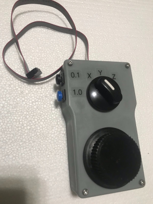
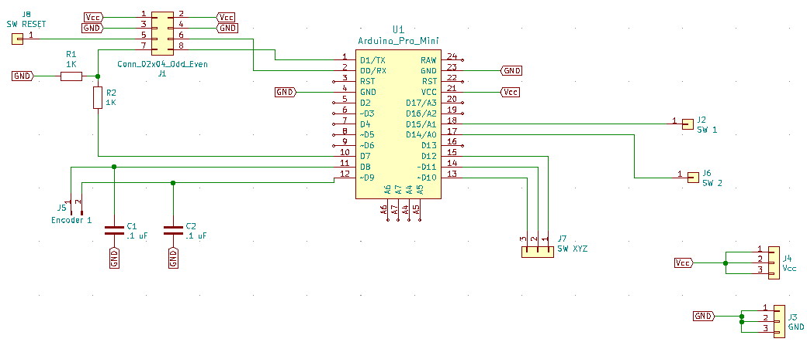
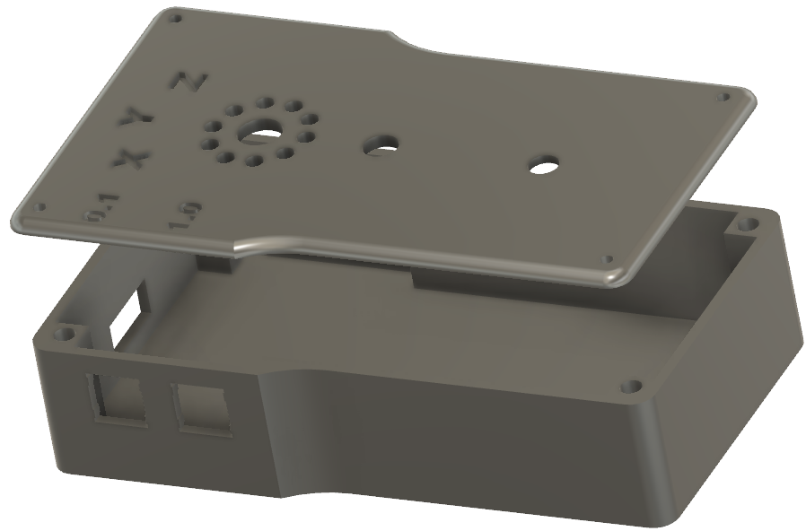

# Pendant Controller for 3018 CNC
An Arduino based Handwheel Pendant for a generic 3018 CNC.  Allows you to easily move the X, Y and Z axis using the handwheel.  You can dial in the exact position using the 0.1 mm/step or quickly move to a new location using the 1.0 mm/step buttons.

### Required Hardware
1. 1x Arduino Pro Mini (or compatible)
1. 1x KY-040 Rotary Encoder ([Amazon](https://www.amazon.com/gp/product/B07D356LRH/ref=ppx_yo_dt_b_asin_title_o04_s00?ie=UTF8&psc=1))
1. 1x SP3T Rotary Switch ([Amazon](https://www.amazon.com/gp/product/B018LYU3OO/ref=ppx_yo_dt_b_asin_title_o01_s00?ie=UTF8&psc=1))
1. 4x M3 x 6mm screws
1. 4x M3 x 5mm x 3mm thread inserts ([Amazon](https://www.amazon.com/cSeao-120pcs-Inserted-Knurled-Embedded/dp/B07D683Q26/ref=sr_1_4?crid=11IEQW4CEOOYW&keywords=m3%2B5mm%2Bthread%2Binserts&qid=1643132299&sprefix=m3%2B5mm%2Bthread%2Binserts%2Caps%2C78&sr=8-4&th=1]))
1. 2x 12mm momentary SPST square push buttons
1. 1x 2x4 (8 pin) 2.54mm pitch flat ribbon cable
1. 1x 2x4 2.54mm pitch connector (optional, for PCB) ([Amazon](https://www.amazon.com/gp/product/B07WPBQPBT/ref=ppx_yo_dt_b_asin_title_o03_s00?ie=UTF8&psc=1))

### This repo includes
1. [/src](/src) = Source code for an Arduino Pro Mini (PlatformIO)
2. [/pcb](/pcb) = Schematic and PCB layout (KiCad)
3. [/model](/model) = STEP, Fusion360 and 3MF files for 3D printing the case and handwheel

## Source Code
Build using the PlatformIO plugin for VS Code.  Targeting Arduino Pro Mini but any board can be used as long as it has at least 7 open IO Ports

## Schematic (Optional) 
Optional schematic and PCB to help cleanup the wiring.  Bypass capacitors are used on the encoder data lines to help reduce switch bounce.

### PCB

## Models
3D Models for case and handwheel to 3D print.  I used a resin printer but the models should be easily printable on FDM Printers.  The Models directory includes the SMF files to print unmodified and STEP files included for situations where you want to modify the models i your favorite CAD program.  Fusion 360 files also included for users of that program.

### Case & Handwheel Models

 
